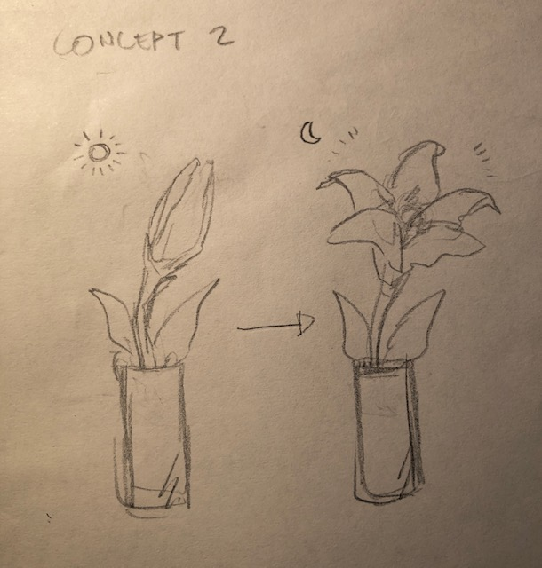
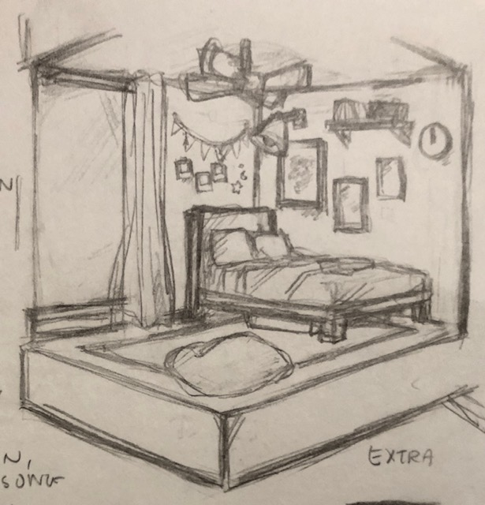

# 1701QCA Making Interaction - Assessment 2 workbook

You will use this workbook to keep track of your progress through the course and also as a process journal to document the making of your projects. The comments in italics throughout the template give suggestions about what to include. Feel free to delete those instructions when you have completed the sections.

When you have completed the template, submit the link to the GitHub Pages site for this repository as a link in Learning@Griffith. The link should be something like [https://qcainteractivemedia.github.io/1701QCA-Assessment2/](https://qcainteractivemedia.github.io/1701QCA-Assessment2/) where `qcainteractivemedia` is replaced with your GitHub username and `1701QCA-Assessment2` is replaced with whatever you called the repository this template is contained in when you set it up.

## Project working title ##
*Mini Room*

## Related projects ##
*Find about 6 related projects to the project you choose. A project might be related through  function, technology, materials, fabrication, concept, or code. Don't forget to place an image of the related project in the appropriate folder and insert the filename in the appropriate places below. Copy the markdown block of code below for each project you are showing.*

### Related project 1 ###
*Name: micro:bit Smart Home (with BH1750, BME280, HC-SR501, SW-420 sensors and LCD 1602)*

*URL: https://www.youtube.com/watch?v=m64T7HHNOII*

This project relates through the concept of building a smart home through a microbit. I found this project after starting mine as I didn’t have enough related projects and I found that this was really similar to the functions I’ve included for mine such as the automatic fan and light. *.

### Related project 2 ###
*Name: Smarthon Smart House Kit for micro:bit (model 2)*

*URL: https://www.youtube.com/watch?v=us7mOg1nLG8*

This project relates through the concept of building a smart home through a microbit. This was also found after I began and I found that the creator also has a similar function with the fan however, can be manually turned on through the microbit buttons. *.

### Related project 3 ###
*Name: micro:bit SOKIT : Making a smart house.*

*URL: https://it-it.facebook.com/thinksokit/videos/vb.1651182875206612/319983735368250/?type=2&theater*

This project relates through the concept of a smart home, with the functions of turning on light and changing colour.*.

### Related project 4 ###
*Name: BBC micro:bit - Door Alarm system with smart Light*

*URL: https://www.youtube.com/watch?v=ZOLvpmQ5HOs*

This project relates through the concept, with the functions of a smart light and uses the buzzer to create a door alarm system.*.

### Related project 5 ###
*Name: Micro:bit Smart Home - light, fan and alarm system.*

*URL: https://www.hackster.io/73125/micro-bit-smart-home-light-fan-and-alarm-system-bd1e6f*

This project is related to mine because it includes an automatic light and fan.*.

### Related project 6 ###
*Microbit Smart Home Kit: Smart Home [BM]*

*URL:https://www.youtube.com/watch?v=O-ALLqKYfRo&t=83s*

This project is related to mine because the material they have used to make this project is cardboard which is the material I have mainly used.

## Other research ##
*1. Micro:bit - Heat activated Fan*

*This was used in the previous project of the temperature gauge, and helped me in the process of making the functions of the ceiling fan.*

*2. Micro:bit Pins*

*This helped me understand more about the pins as I was having trouble with space which can be seen in the fifth design process discussion.*

### *Brief resource name/description* ###

*1. https://www.youtube.com/watch?v=iilfeimMDjM*

*2. https://makecode.microbit.org/device/pins*

## Conceptual progress ##

### Design intent ###
*Include your design intent here. It should be about a 10 word phrase/sentence.*

*My design intent is to create a decorative item/doll house that is interactive.*

### Design concept 1 ###
*Outline three design concepts, each developed to a point where you anticipate it would be feasible to complete by the end of the course. Each should have a summary of the idea, a rough sketch of what it might be like, and any other notes you created while exploring the idea.* 

*Put the first two design concepts in the sections "Design concept 1" and "Design concept 2". Then put the third, with more development in the section "Final design concept".*

*The first concept was based off of the game Animal Crossing. The recent release of Animal Crossing New Horizons is where the inspiration came from however, I have based it off a feature in the previous game of a train station in Animal Crossing New Leaf. Some of the functions in this concept that I was going to implement are an object that represents the train in the game would be placed on the track which the lights would flicker, the bars would go down and it would make a beeping sound just like in the game.*

### Design concept 2 ###
*The second concept would be a flower lamp that opens up when dark which lights up in the middle and closes when it is bright.*

### Final design concept ###
*This more fully developed concept should include consideration of the interaction scheme, technical functionality, fabrication approach, materials to be used, and aesthetic.*

*The third and chosen concept would be a room which the light would turn on when its dark, the fan would turn on when the temperature is high and different songs would be played with one button.*
*The main materials to be used would be cardboard for the structure of the room and furniture and paper for covering the cardboard.*

### Interaction flowchart ###
*Draw a draft flowchart of what you anticipate the interaction process in your project to be. Make sure you think about all the stages of interaction step-by-step. Also make sure that you consider actions a user might take that aren't what you intend in an ideal use case. Insert an image of it below. It might just be a photo of a hand-drawn sketch, not a carefully drawn digital diagram. It just needs to be legible.*

## Physical experimentation documentation ##

*In this section, show your progress including whichever of the following are appropriate for your project at this point.
a.	Technical development. Could be code screenshots, pictures of electronics and hardware testing, video of tests. 
b.	Fabrication. Physical models, rough prototypes, sketches, diagrams of form, material considerations, mood boards, etc.
Ensure you include comments about the choices you've made along the way.*

*You will probably have a range of images and screenshots. Any test videos should be uploaded to YouTube or other publicly accessible site and a link provided here.*

## Design process discussion ##
*I worked on getting the fan blade to work with the piezo element buzzer making sounds. I have used similar coding to the previous project I have done with the temperature gauge and included the coding for when the external button is pressed, sounds would be made through the buzzer with the help of experiment 6 from the Inventor’s Kit Tutorial Book.*

## Design process discussion ##
*The digital write pin was set to P2 instead of P4 for the fan as this was taken after testing the LED lights.*

## Design process discussion ##
*Before, I had a default tune that can be found in the “play melody” block however, I played around with the tones to create a tune from a film by Ghibli Studios.*

## Design process discussion ##
*I also started building the room with cardboard, paper, and the scraps of material that I had. *

## Design process discussion ##
*Next I worked on including the automatic light. I was having some issues with space as I had no more of the large pins left. Pin 0 was connected to the buzzer, pin 1 was connected to the external button for the buzzer and pin 2 was connected to the fan. I changed the pin that was connected to the button to pin 5 as I found that the pin is a GPIO shared with button A, which opened up space for pin 1. I still needed one more pin for the LED, as I used pin 1 to place the phototransistor.*

## Design process discussion ##
*I was using the microbit LED screen to show icons so I could see if the phototransistor was working. I removed the function of this as I found that some of the pins had the same functions as the large pins with the GPIO and ADC but can only be used when the LED is not on. I switched the pin for the fan with the LED so that it is in pin 2 and placed the wire connected to the fan to pin 4 as it wouldn’t work oppositely. *

## Next steps ##
*I am planning on figuring out how to implement the LED light in the room as it is currently on the breadboard. I am also planning on using the RGB LED instead of the red LED so it can be a colour that is realistic to a normal home and possibly could change colour through maybe the use of the potentiometer and the finger adjust spindle similar to experiment 3.
I would need to find a way to include the button for the music player in the room instead of just being placed on the bread board and figure out if there is a way to include different tunes using one button. So far, I have not found one yet and tested out ways to make this happen.
I might also plan on including more functions if I still have enough wires such as maybe a function utilising the servo.
The structure will also need to be worked on such as hiding the wires and adding more details into the room to look more aesthetically pleasing.
*
